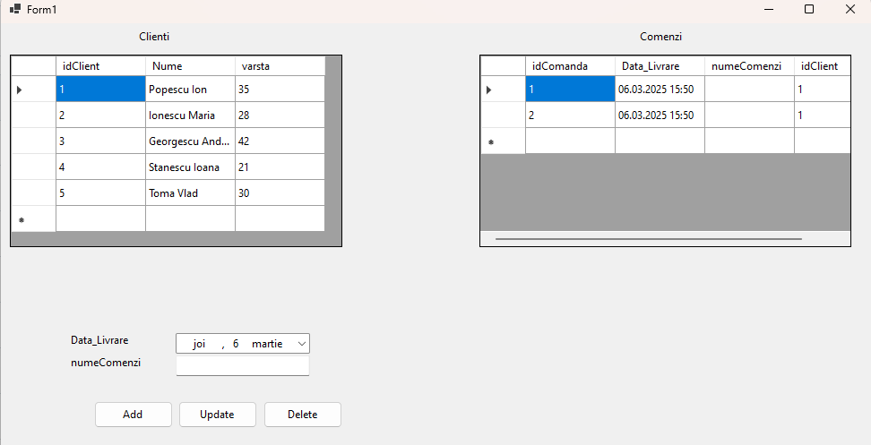
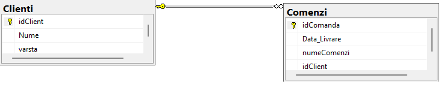

# Simple .NET WinForms Orders Management

A **simple .NET application** that uses WinForms to manage orders placed by customers.  
The database connection is configured in `App.config`, while the table names, column counts, and column names are set in `appSettings`.

When the form loads, data from both tables is loaded into a `DataSet`, the relationship between the tables is created, and a `DataGridView` is linked via a `BindingSource`. Additionally, controls are generated dynamically for each column in the child table (`TextBox` or `DateTimePicker`).

## CRUD Operations

- **Delete** a record for a client
- **Update** a record for a client
- **Add** a record for a client

After each operation, the data is reloaded into the `DataSet`.

